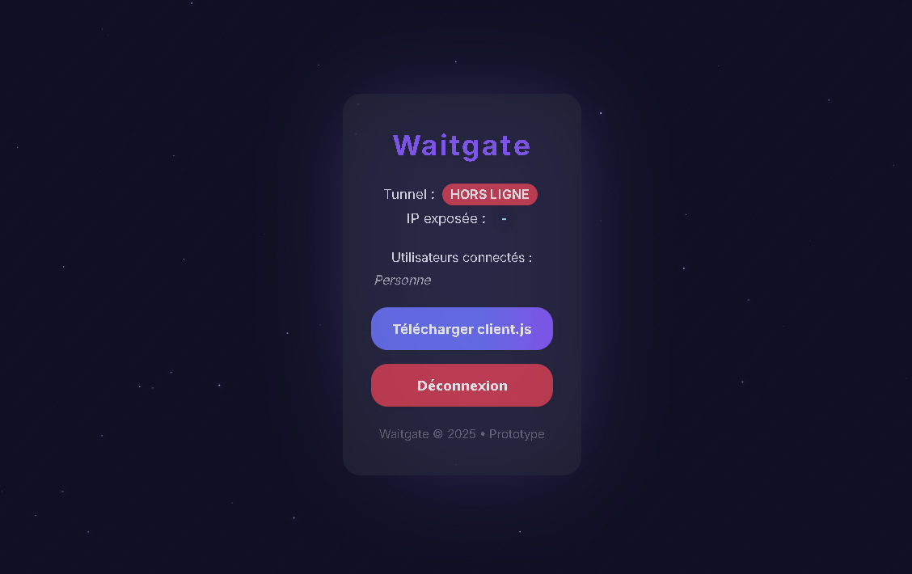
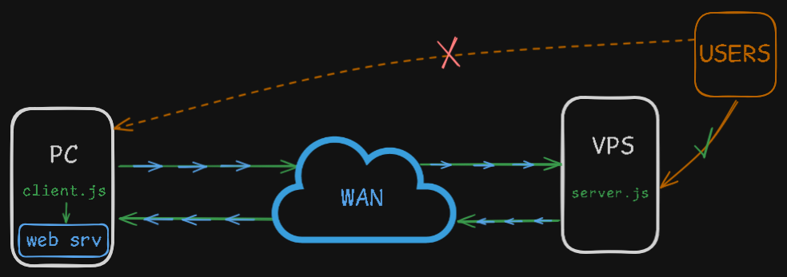

<h1 align="center">Waitgate </h1>

<p align="center">
  <a href="https://waitgate.onrender.com/">
    
  </a>
</p>

> Waitgate is a fully self-hosted, secure reverse proxy tunnel, designed to expose any local service (HTTP, HTTPS, raw TCP, SSH, RDP, etc.) without ever directly exposing a public IP or port. All application data is encrypted client-side (ChaCha20-Poly1305) before being sent through the WebSocket tunnel (WS or WSS, HTTP or HTTPS). Modern admin dashboard, only one port to open, security and simplicity first.

<p align="center">
  <a href="https://waitgate.onrender.com/">
    
  </a>
</p>

---

## ✨ Features

- 🔒 Even on HTTP, everything’s already ChaCha20-Poly1305 encrypted. Nothing’s in cleartext.
- 🕳️ Bypass NAT/firewall via outgoing tunnels
- 🖥️ Expose any TCP or raw TCP service securely (HTTP, HTTPS, SSH, RDP, etc.)
- 🌐 Transparent reverse proxy for HTTP/HTTPS
- ⚙️ Single public port (web + TCP over the same port)
- 🔧 Secured admin dashboard (login encrypted client-side)
- 🔑 Tunnel authentication via token + user/pass
- 📦 Auto-generated client.js script
- 🔥 No heavy dependencies (pure Node.js, no SQL)
- 👁️ Real-time view of connected users
- 👤 Self-hosted, open source

---

## 🚀 Installation

1. **Clone the repo:**

```bash
git clone https://github.com/votre_user/waitgate.git
cd waitgate
```

3. **Install dependencies:**

```bash
npm install
```

4. **Start the server:**

```bash
node server.js
```

5. **Access the dashboard:**

- [http://localhost:8000/dashboard](http://localhost:8000/dashboard)
- Default login: admin / (randomly generated at first launch)

6. **Download the tunnel client:**

- From dashboard (“Download client.js” button)
- Or [http://localhost:8000/download](http://localhost:8000/download)

7. **Configure client.js:**

- Edit `LOCAL_HOST` & `LOCAL_PORT` in client.js on the target machine.
- Run:

```bash
node client.js
```

---

## 🧰 Environment variables (.env)

- `TUNNEL_CHACHA_KEY` : ChaCha20-Poly1305 encryption key (256 bits, auto-generated)
- `TUNNEL_TOKEN` : Tunnel connection token (wgt_ prefix, auto-generated)
- `DASH_USER` / `DASH_PASS` : Admin credentials
- `LOGIN_SECRET` : Password encryption key for dashboard login

Edit the `.env` file to customize.

---

## 🔐 Security

- **ChaCha20-Poly1305 application-level encryption** : All buffers are encrypted before being sent through the tunnel (WS, WSS, HTTP, HTTPS). Even on plain HTTP/WS, your data is not readable without the ChaCha20 key.
- **No public port required on the client side** (outgoing only).
- **Strong authentication for both dashboard and tunnel.**
- **No admin/tunnel secret is ever stored client-side.**

> ⚠️ **Waitgate does not require HTTPS/TLS or any proxy on its own port. Only the service you want to expose needs to handle HTTPS/TLS if required (for ex: if you expose a web server with HTTPS, it’s your web server that must serve HTTPS, not Waitgate). Waitgate simply tunnels all traffic as-is. Every message is individually ChaCha20-encrypted client-side before entering the tunnel. If you run Waitgate behind a reverse proxy (Nginx, Caddy, etc.), only HTTP services can be exposed; raw TCP will not work through the tunnel.**

---

## 📦 Project structure

```
waitgate/
├─ core/
│  ├─ crypto-utils.js      # ChaCha20-Poly1305 encryption/decryption
│  ├─ tcp-tunnel.js        # TCP tunnel logic
│  └─ ws-handler.js        # WebSocket handler
├─ routes/
│  ├─ dashboard.js         # HTTP/dashboard routing
│  └─ download.js          # Generates client.js
├─ views/                  # HTML frontend
│  ├─ index.html
│  ├─ login.html
│  └─ panel.html
├─ config.js               # Env management
├─ server.js               # Main server entry
└─ .env                    # Secret config (auto)
```

---

## 📝 Examples of use

- **Expose an internal web service to the outside (no public IP/port exposed).**
- **Share a dev service temporarily (API, webapp, SSH, etc.).**
- **Secure remote raw TCP access (shell, RDP, local proxy, etc.).**
- **Create a temporary, secured TCP bastion to a specific port.**



---

## 👤 Author

Project by [Macxzew](https://github.com/Macxzew)

---

## ⭐ Show your support

Give a ⭐️ if this project helped you!

***
